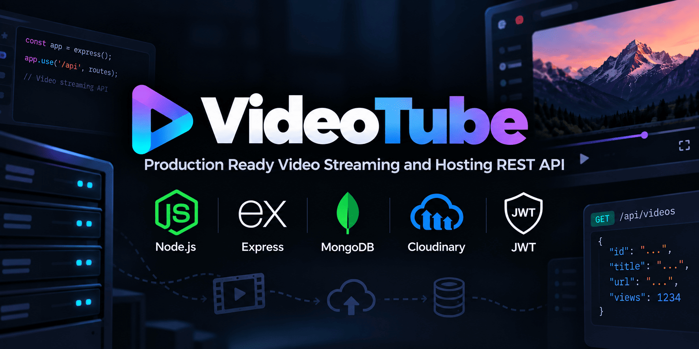
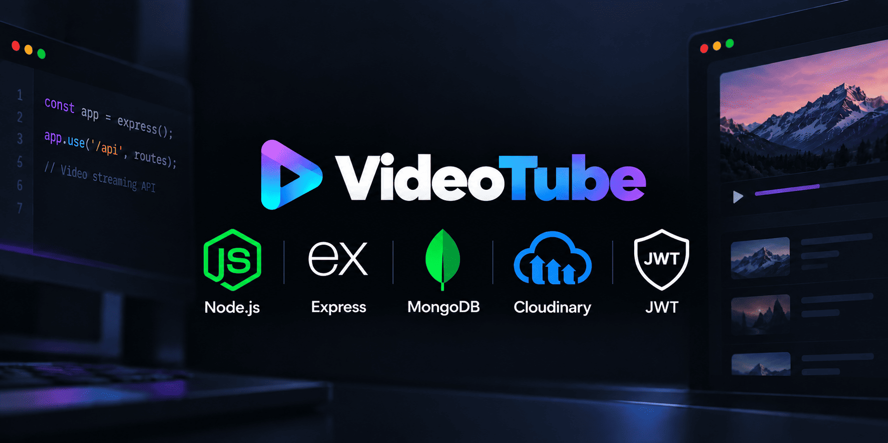
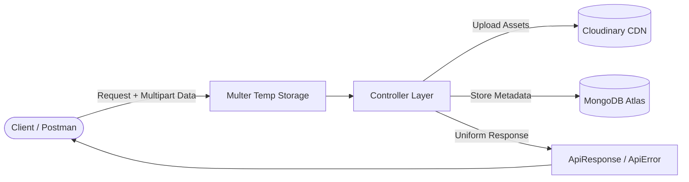

<!-- <p align="center">
  
</p> -->



<div align="center">

<!-- # 🎬 VideoTube -->

**A production-ready, scalable video hosting & streaming REST API built with Node.js, Express, and MongoDB.**

[](https://nodejs.org/)
[](https://expressjs.com/)
[](https://www.mongodb.com/)
[](https://cloudinary.com/)
[](https://jwt.io/)

</div>

---

## ⚡ Overview

**VideoTube** is a backend service powering video streaming, content distribution, and social interactions (likes, comments, subscriptions, playlists, and user profiles). Designed with clean architecture, enterprise error handling, and secure authentication workflows.

---

## 🌟 Key Features

- **🔐 Dual-Token Authentication** — Secure user access with short-lived JWT Access Tokens & long-lived Refresh Tokens.
- **☁️ Cloud Media Pipeline** — Multipart form handling with **Multer** and automated asset optimization & upload via **Cloudinary**.
- **🛡️ Standardized API Standard** — Uniform response structures (`ApiResponse`) and centralized error handling (`ApiError`).
- **⚡ Mongoose Aggregation Pipelines** — High-performance pagination, watch history tracking, and channel subscription metrics.
- **🔒 Secure by Design** — Passwords hashed with **Bcrypt**, CORS configured for granular origin control, and HTTP-only cookie support.

---

## 🏗️ Architecture & Request Flow



---

## 📁 Project Structure

```
src/
├── controllers/      # Request handlers & core business logic
├── db/               # Database connection & lifecycle management
├── middlewares/      # Multer, Auth guards, validation middlewares
├── models/           # Mongoose schemas & custom methods
├── routes/           # RESTful API route definitions
└── utils/            # Async wrappers, ApiError, ApiResponse, Cloudinary
```

---

## ⚙️ Quick Start

### 1. Clone & Install Dependencies

```bash
git clone https://github.com/Divyanshu0902/VideoTube.git
cd VideoTube
npm install
```

### 2. Configure Environment Variables

Create a `.env` file in the root directory:

```env
PORT=8000
MONGODB_URI=mongodb+srv://<username>:<password>@cluster.mongodb.net
CORS_ORIGIN=*

# JWT Secrets
ACCESS_TOKEN_SECRET=your_access_token_secret
ACCESS_TOKEN_EXPIRY=1d
REFRESH_TOKEN_SECRET=your_refresh_token_secret
REFRESH_TOKEN_EXPIRY=10d

# Cloudinary
CLOUDINARY_CLOUD_NAME=your_cloud_name
CLOUDINARY_API_KEY=your_api_key
CLOUDINARY_API_SECRET=your_api_secret
```

### 3. Run Development Server

```bash
npm run dev
```

Server will start listening on `http://localhost:8000`.

---

## 👤 Author

**Divyanshu Kumar**  
- GitHub: [@Divyanshu0902](https://github.com/Divyanshu0902)

---
<div align="center">
  <sub>Built with ❤️ for scalable media streaming architectures.</sub>
</div>
