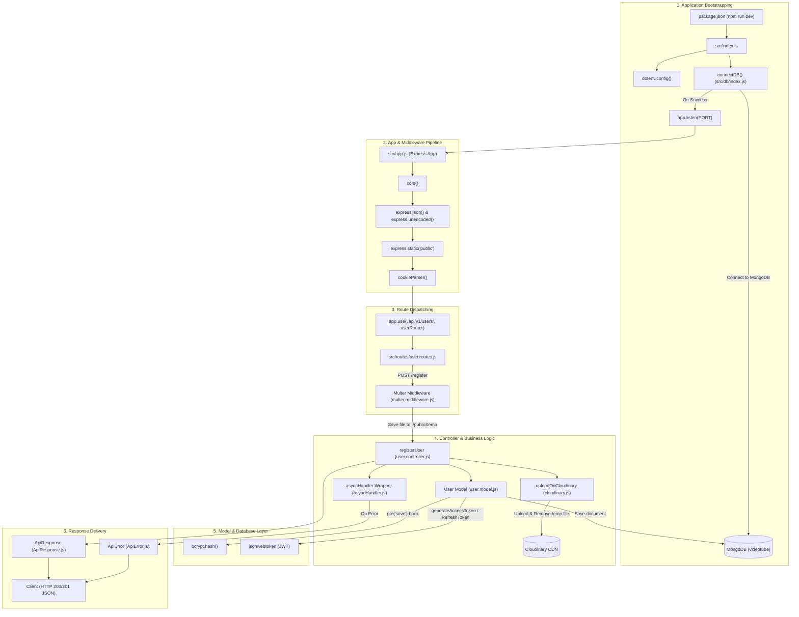

# YouTube Backend Mermaid Diagram Code

```mermaid
flowchart TD
    subgraph Bootstrapping ["1. Application Bootstrapping"]
        A["package.json (npm run dev)"] --> B["src/index.js"]
        B --> C["dotenv.config()"]
        B --> D["connectDB() (src/db/index.js)"]
        D -->|"Connect to MongoDB"| DB[("MongoDB (videotube)")]
        D -->|"On Success"| E["app.listen(PORT)"]
    end

    subgraph AppPipeline ["2. App & Middleware Pipeline"]
        E --> F["src/app.js (Express App)"]
        F --> G1["cors()"]
        G1 --> G2["express.json() & express.urlencoded()"]
        G2 --> G3["express.static('public')"]
        G3 --> G4["cookieParser()"]
    end

    subgraph Routing ["3. Route Dispatching"]
        G4 --> H["app.use('/api/v1/users', userRouter)"]
        H --> I["src/routes/user.routes.js"]
        I -->|"POST /register"| J["Multer Middleware (multer.middleware.js)"]
    end

    subgraph ControllerLogic ["4. Controller & Business Logic"]
        J -->|"Save file to ./public/temp"| K["registerUser (user.controller.js)"]
        K --> L["asyncHandler Wrapper (asyncHandler.js)"]
        K --> M["uploadOnCloudinary (cloudinary.js)"]
        M -->|"Upload & Remove temp file"| CLOUD[("Cloudinary CDN")]
        K --> N["User Model (user.model.js)"]
    end

    subgraph DatabaseLayer ["5. Model & Database Layer"]
        N -->|"pre('save') hook"| O["bcrypt.hash()"]
        N -->|"generateAccessToken / RefreshToken"| P["jsonwebtoken (JWT)"]
        N -->|"Save document"| DB
    end

    subgraph ResponseFlow ["6. Response Delivery"]
        K --> Q["ApiResponse (ApiResponse.js)"]
        L -->|"On Error"| R["ApiError (ApiError.js)"]
        Q --> S["Client (HTTP 200/201 JSON)"]
        R --> S
    end
```
