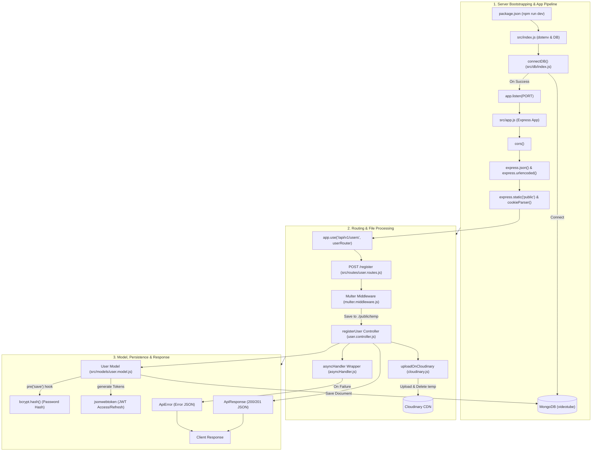

# YouTube Backend Control Flow (Optimized Balanced Layout)

> **Tip:** Open Markdown Preview (`Ctrl + Shift + V`) to view this diagram. The layout is balanced horizontally and vertically to prevent top/bottom clipping when zooming in VS Code.

